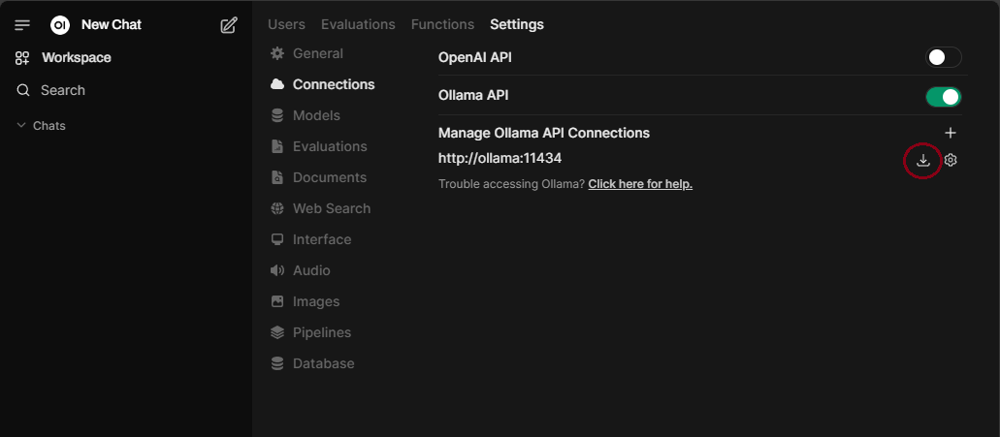

# ai-stack

Just a *quick* and *dirty* docker stack that provides offline *"AI"*:

* [Open WebUI](https://localhost "Open WebUI Web Interface for accessing ollama")
* Ollama (default deepseek-r1:7b)

The stack sits behind a `traefik` proxy

* [Traefik Dashboard](https://localhost:8443 "Traefik Reverse Proxy Dashboard")

## startup

The commands below should get you up and running.

```bash
git clone https://github.com/c-premus/ai-stack.git
cd ai-stack
docker compose up -d
```

To check the status of `ollama` run `docker logs -f ollama`. To verify that the model has completed download, look for output similar to below:

```bash
🔴 Retrieve deepseek-r1:7b model...
pulling manifest
pulling 96c415656d37... 100% ▕████████████████▏ 4.7 GB
pulling 369ca498f347... 100% ▕████████████████▏  387 B
pulling 6e4c38e1172f... 100% ▕████████████████▏ 1.1 KB
pulling f4d24e9138dd... 100% ▕████████████████▏  148 B
pulling 40fb844194b2... 100% ▕████████████████▏  487 B
verifying sha256 digest
writing manifest
success
🟢 Done!
```

Press <kbd>⌃ Control</kbd> + <kbd>C</kbd> to stop viewing the log output.

To check the status of `openwebui` run `docker logs -f openwebui`.  To verify that the server is up and running, look for output similar to below:

```bash
INFO:     Uvicorn running on http://0.0.0.0:8080 (Press CTRL+C to quit)
```

press <kbd>⌃ Control</kbd> + <kbd>C</kbd> to stop viewing the log output.

## models

To load a different model by default, create a `.env` and add the contents below.  Replace `deepseek-r1:32b` with the desired model.  A list of models is available on ollama.com/library.

```bash
OLLAMA_MODEL_PULL=deepseek-r1:32b
```

## usage

[Open WebUI](https://localhost "Open WebUI Web Interface for accessing ollama") is the web interface used to interact with models in `ollama`.  When you access the web page for the first time you must create an admin account.  After registering you should be able to query away.

Additional models can be added to `ollama` in the admin settings <https://localhost/admin/settings> under *Connections*:



Other than that you should pretty much be able to start chatting.


## cleanup

To stop everything and remove the containers run:

```bash
docker compose down
```

To remove images (*they're not incosequential*).

```bash
docker image rm traefik
docker image rm ollama
docker image rm open-webui
```

To just remove all unused images:

```bash
docker image prune --all
```

All application files are saved locally in the `ollama` and `openwebui` subdirectories.  Those subdirectories are included in `.gitignore` so they aren't uploaded to github.

## update

To update the docker images and recreate containers run:

```bash
docker compose pull
docker compose up -d
```

The latest version of the default `ollama` model is pulled on container startup via the `scripts/ollama-entry.sh` script.  Models can also be updated in the web `open-webui` interface.
